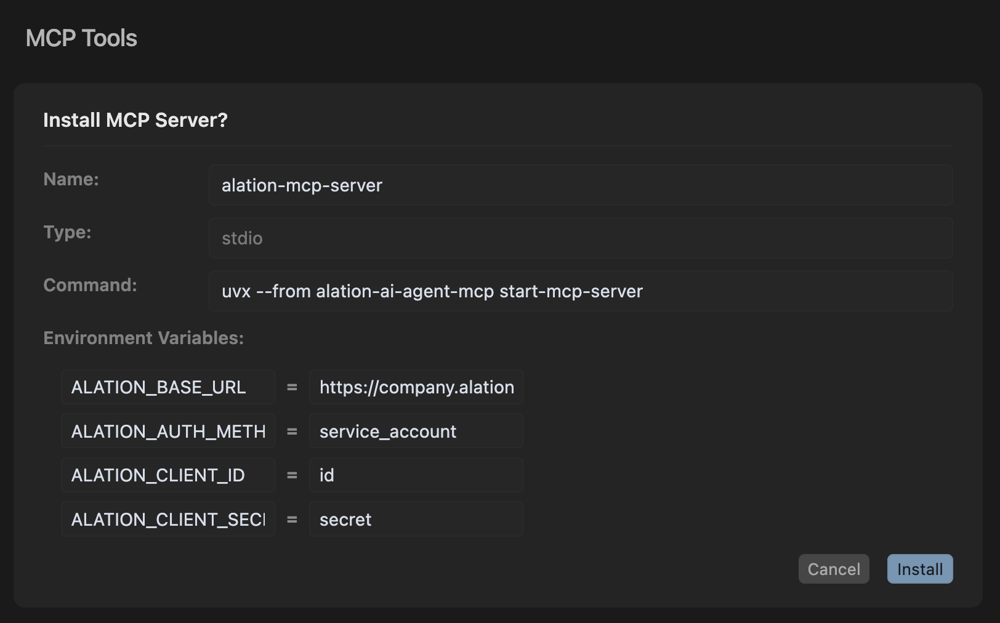
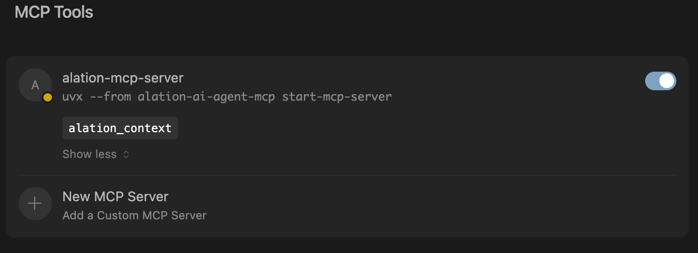

# Adding MCP Server to Code Editors

> **Note:** For all installations, have all the variables for the authentication mode of your choice ready, based on the [authentication guide](../authentication.md).

This guide explains how to add the MCP server to popular code editors such as VS Code and Cursor.

## Prerequisites

Ensure you are using a recent version of your code editor. For VS Code, use **April 2025 (version 1.100)** or newer. For Cursor, use the latest available version.

## Steps

1. Navigate to the root of your repository.
2. Create a `.vscode` folder if it does not already exist.
3. Add a `mcp.json` file to the folder with the following content:

    ```json
    {
        "servers": {
            "alation-mcp-server": {
                "command": "uvx",
                "args": [
                    "--from", "alation-ai-agent-mcp", "start-mcp-server"
                ],
                "env": {
                    "ALATION_BASE_URL": "https://company.alationcloud.com",
                    "ALATION_AUTH_METHOD": "service_account",
                    "ALATION_CLIENT_ID": "<client-id>",
                    "ALATION_CLIENT_SECRET": "<client-secret>"
                }
            }
        }
    }
    ```

4. Save the file.

You can now use the MCP server in your code editor.

---

## Using MCP Server in VS Code

1. Open the Chat view (⌃⌘I on macOS, Ctrl+Alt+I on Windows/Linux), and select **Agent mode** from the dropdown.

    

2. Select the **Tools** button to view the list of available tools.

    Optionally, select or deselect the tools you want to use. You can search for tools by typing in the search box.

    

3. Enter a prompt in the chat input box. Tools will be automatically invoked as needed.

    By default, when a tool is invoked, you need to confirm the action before it is run. Use the **Continue** button dropdown options to automatically confirm the specific tool for the current session, workspace, or all future invocations.

    

---

## Using MCP Server in Cursor

Cursor supports MCP server configuration in two ways:

**1. One-Click Installation**

You can install the MCP server directly in Cursor using the button below:

[](https://cursor.com/install-mcp?name=alation-mcp-server&config=eyJjb21tYW5kIjoidXZ4IC0tZnJvbSBhbGF0aW9uLWFpLWFnZW50LW1jcCBzdGFydC1tY3Atc2VydmVyIiwiZW52Ijp7IkFMQVRJT05fQkFTRV9VUkwiOiJodHRwczovL2NvbXBhbnkuYWxhdGlvbmNsb3VkLmNvbSIsIkFMQVRJT05fQVVUSF9NRVRIT0QiOiJzZXJ2aWNlX2FjY291bnQiLCJBTEFUSU9OX0NMSUVOVF9JRCI6ImlkIiwiQUxBVElPTl9DTElFTlRfU0VDUkVUIjoic2VjcmV0In19)

On clicking the button, you'll be prompted with the following options:



After filling out the required environment variables, go to the settings page to ensure the tools are loaded correctly.



**2. Manual Configuration**

For custom or advanced setups, add your MCP server configuration to either:

- `.cursor/mcp.json` in your project directory (project-specific), or
- `~/.cursor/mcp.json` in your home directory (global for all projects).

The configuration format is the same as described above. Be sure to fill out the environment variables (`env`) according to the instructions in the [authentication guide](../authentication.md):

```json
{
  "mcpServers": {
    "alation-mcp-server": {
      "command": "uvx",
      "args": [
        "--from", "alation-ai-agent-mcp", "start-mcp-server"
      ],
      "env": {
          "ALATION_BASE_URL": "https://company.alationcloud.com",
          "ALATION_AUTH_METHOD": "service_account",
          "ALATION_CLIENT_ID": "<client-id>",
          "ALATION_CLIENT_SECRET": "<client-secret>"
      }
    }
  }
}
```

After installation or configuration, open the chat or tools panel in Cursor to access and use MCP tools, just as you would in VS Code.

---

You can now use the MCP tools effectively in your preferred code editor.
