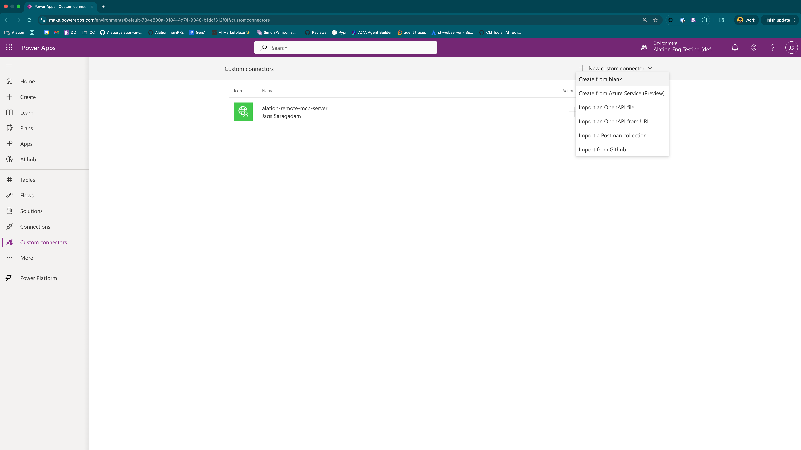
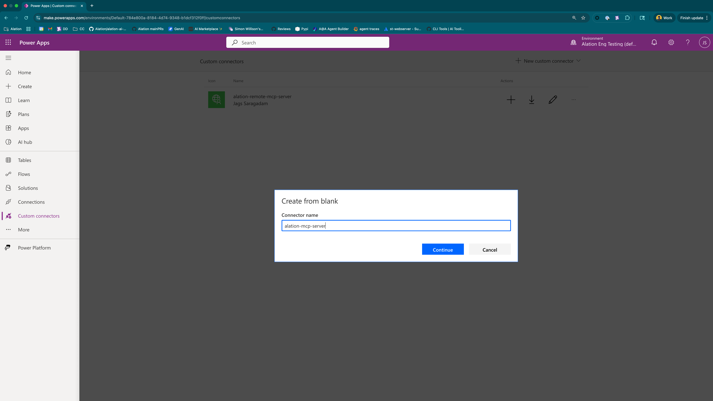
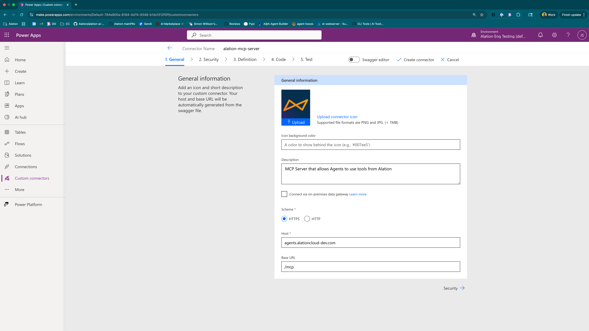
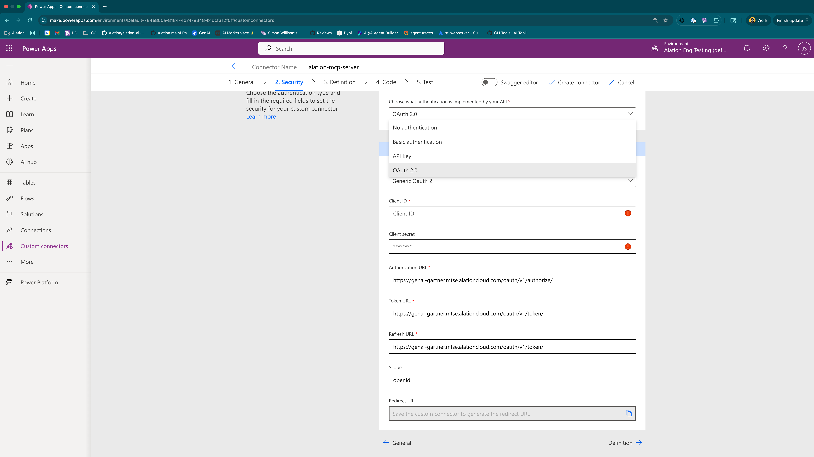
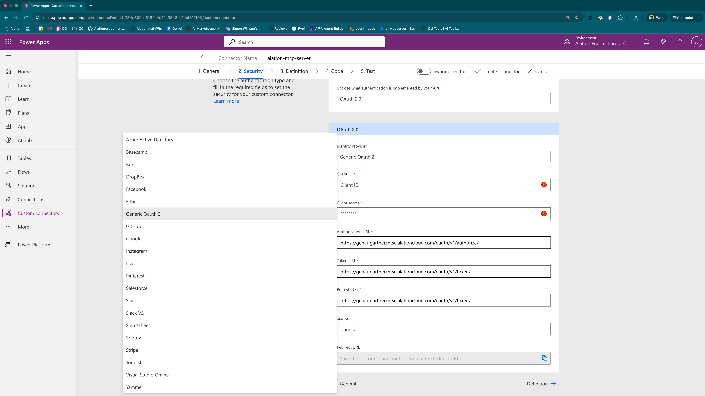
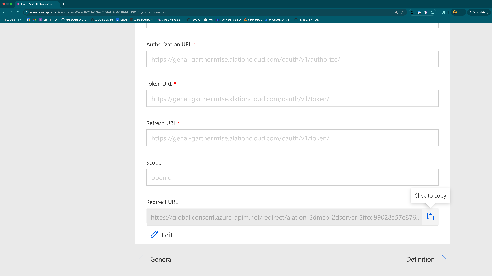
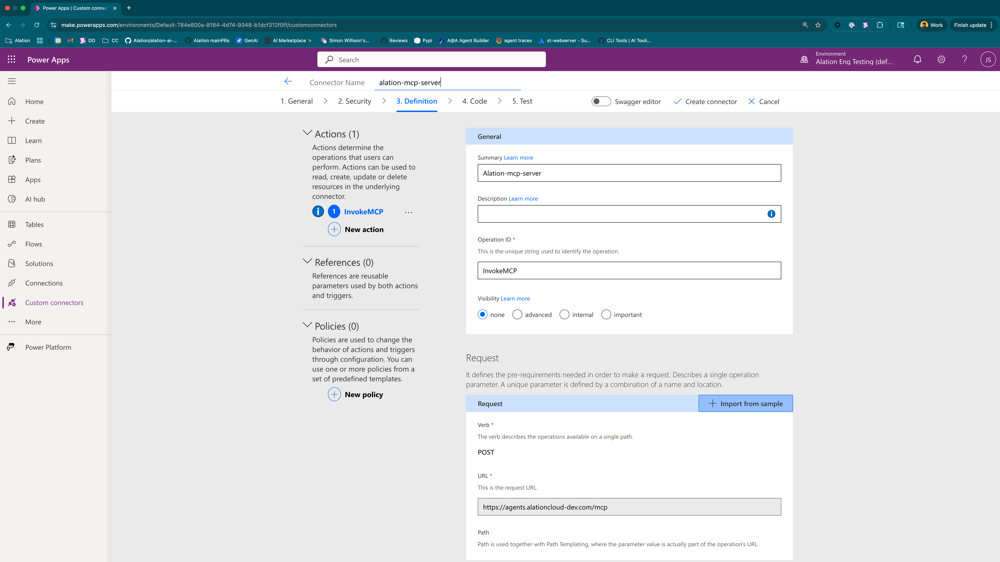

# Create a Power Apps Custom Connector for an Alation MCP Server

This guide provides a complete walkthrough for setting up a custom connector in Microsoft Power Apps to communicate with a deployed Alation Model Context Protocol (MCP) server and connect it to agents created in Copilot Studio.

## Setup Options

You can create this connector using either method:

1. **UI-Based Setup** (Recommended for beginners): Follow the step-by-step UI instructions below
2. **OpenAPI Specification** (Advanced users): If you prefer working directly with YAML/JSON specifications, you can skip the UI steps and use the [Complete OpenAPI Specification](#complete-openapi-specification) section at the bottom of this guide to import the entire connector definition at once.

## Authentication Options

### Production Setup (Recommended): OAuth 2.0
For production deployments, use OAuth 2.0 authentication as described in the main setup instructions below. This provides:
- Long-lived authentication
- User-specific permissions and personalized results
- Secure credential rotation
- Multi-user support

### Testing Setup: API Key Authentication
For **testing purposes only**, you can use API key authentication for faster setup. However, this approach has significant limitations:

⚠️ **API Key Limitations (Not recommended for production):**
- API keys are short-lived (default 24 hours TTL)
- Tied to a single user account
- Difficult to rotate securely
- Do not provide personalized results
- Less secure than OAuth

**When to use API key authentication:**
- Initial testing and proof of concept
- Development environments
- Quick demonstrations

**API Key Setup Instructions:**
1. Generate an API token following: [Create a refresh token via the UI](https://developer.alation.com/dev/docs/authentication-into-alation-apis#create-a-refresh-token-via-the-ui)
2. For extended testing, you can request TTL extension beyond 24 hours
3. Use the [API Key OpenAPI Specification](#api-key-openapi-specification) instead of the OAuth version
4. When prompted for the API key in Power Apps, format it as: `Bearer <your-api-token>`
   - **Critical**: The word "Bearer", the space, and the token format are mandatory
   - Example: `Bearer eyJ0eXAiOiJKV1QiLCJhbGciOiJS...`

For complete authentication details, refer to: [Authentication Guide](https://github.com/Alation/alation-ai-agent-sdk/blob/main/guides/authentication.md)

## Prerequisites

Before you begin, ensure you have the following:

### 1. Access Requirements
- **Power Apps Premium License**: Custom connectors require a Power Apps Premium license or per-app plan
- **Alation Instance Access**: Admin or appropriate API access to your Alation Data Catalog
- **Azure Environment**: Access to deploy and manage Azure resources (if using Azure Container Apps)

### 2. Deploy the MCP Server
You must have a running Alation MCP server instance in **HTTP mode** (not STDIO mode).

#### Quick Docker Deployment
```bash
# Set required environment variables
export ALATION_BASE_URL="https://your-alation-instance.alationcloud.com"

# Run the server in HTTP mode
docker run -d \
  -e ALATION_BASE_URL=$ALATION_BASE_URL \
  -p 8000:8000 \
  --name alation-mcp-server \
  ghcr.io/alation/alation-ai-agent-sdk/alation-mcp-server:latest \
  --transport http --host 0.0.0.0 --port 8000
```

#### Production Azure Container Apps Deployment (Recommended)
For production use, deploy to Azure Container Apps with:
- Automatic HTTPS certificates
- Built-in scaling and health monitoring  
- Integration with Azure networking

**Complete Setup Guide**: Follow the detailed MCP server setup instructions: [`https://github.com/Alation/alation-ai-agent-sdk/blob/main/python/dist-mcp/README.md`](https://github.com/Alation/alation-ai-agent-sdk/blob/main/python/dist-mcp/README.md)

**Azure Container Apps Deployment**: For a robust cloud deployment walkthrough, see: [Build and deploy a Model Context Protocol server](https://learn.microsoft.com/en-us/azure/developer/ai/build-mcp-server-ts?tabs=github-codespaces)

### 3. Network and Security Configuration
- **HTTPS Endpoint**: Your MCP server must be accessible via HTTPS (HTTP will not work with Power Apps)
- **Network Accessibility**: The endpoint must be reachable by Microsoft Power Platform services
- **Authentication**: OAuth 2.0 integration with your Alation instance (configured in later steps)
  
---

## Connector Setup Instructions

### Step 1: Access Power Apps and Create Custom Connector

1. **Navigate to Power Apps**: Go to [make.powerapps.com](https://make.powerapps.com) and sign in with your organizational account
2. **Select Environment**: Ensure you're in the correct Power Platform environment (top-right dropdown)
3. **Access Custom Connectors**: In the left navigation, expand "More" → "Discover all" → "Custom connectors"
   
   

4. **Create New Connector**: Click **"+ New custom connector"** → **"Create from blank"**
5. **Name Your Connector**: Use a descriptive name like `alation-mcp-server` and click **Continue**

   

### Step 2: Configure General Information (Tab 1)

On the **General** tab, configure the basic connector settings:

**Required Fields:**
- **Description**: Add a clear description (e.g., "Connects to Alation MCP Server for data catalog operations")
- **Scheme**: Select `HTTPS` (Required - HTTP will not work)
- **Host**: Enter your MCP server hostname (e.g., `your-server.azurecontainerapps.io`)
- **Base URL**: Enter `/mcp`

**Optional but Recommended:**
- Upload a custom icon for easy identification
- Add contact information in the description

**Example Configuration:**
```
Host: my-alation-mcp.azurecontainerapps.io
Base URL: /mcp
Description: Alation MCP Server Connector - Provides access to Alation Data Catalog via MCP protocol
```



**❗ Critical Note**: Verify your MCP server is running and accessible before proceeding.

### Step 3: Configure OAuth 2.0 Authentication (Tab 2)

⚠️ **Important Process Note**: This step involves a two-phase process requiring coordination with your Alation administrator.

#### Phase 1: Initial Setup with Placeholder Values

1. Navigate to the **Security** tab
2. Set **Authentication type** to `OAuth 2.0`

   

3. Configure OAuth settings:
   - **Identity Provider**: Select `Generic Oauth 2`
   - **Client ID**: Enter `placeholder_id` (temporary)
   - **Client Secret**: Enter `placeholder_secret` (temporary)
   - **Authorization URL**: `https://your-alation-instance.com/oauth/v1/authorize/`
   - **Token URL**: `https://your-alation-instance.com/oauth/v1/token/`
   - **Refresh URL**: `https://your-alation-instance.com/oauth/v1/token/`
   - **Scope**: `openid`

   

4. **Save to Generate Redirect URL**: Click **"Create connector"** at the top
5. **Copy the Redirect URL**: After saving, a redirect URL appears at the bottom of the page - **copy this URL immediately**

   

#### Phase 2: OAuth Application Setup

**📧 Action Required - Contact Your Alation Customer Success Manager:**

Send the copied Redirect URL to your Alation CSM with the following information:

**Required Information for CSM:**
- **Redirect URL**: [PASTE_YOUR_COPIED_REDIRECT_URL_HERE]
- **Application Name**: Power Apps MCP Connector
- **Integration Type**: Power Apps Custom Connector
- **Required Scopes**: `openid`

Your CSM will coordinate with the Alation technical team to create the OAuth application and provide you with the Client ID and Client Secret needed to complete the setup.

#### Phase 3: Update with Real Credentials

Once you receive the real Client ID and Client Secret from your Alation CSM:

1. Return to the **Security** tab in your Power Apps connector
2. Replace `placeholder_id` with the real **Client ID**
3. Replace `placeholder_secret` with the real **Client Secret**  
4. Click **"Update connector"** to save

**🔐 Security Note**: Keep the Client Secret secure and never share it in documentation or version control.

### Step 4: Define API Operations (Tab 3 - Definition)

Configure the MCP endpoint that Power Apps will call:

1. **Navigate to Definition Tab**: Click on **"3. Definition"**
2. **Create New Action**: Click **"+ New action"**
3. **Configure Action Details**:
   - **Summary**: `Invoke Alation MCP Server`
   - **Description**: `Sends requests to Alation MCP server for data catalog operations`
   - **Operation ID**: `InvokeMCP` (must be unique, no spaces)

4. **Import API Endpoint**:
   - Under **Request** section, click **"+ Import from sample"**
   - **Verb**: Select `POST`
   - **URL**: Enter your complete MCP endpoint: `https://your-server-hostname.com/mcp`
   - Click **Import**

   

5. **Optional - Verify OpenAPI Specification**:
   You can verify the generated configuration by viewing the underlying OpenAPI specification. The key elements should include:
   - POST method to `/mcp` endpoint
   - OAuth 2.0 security configuration
   - The critical `x-ms-service-protocol: mcp-streamable-1.0` property for Copilot Studio integration

**⚠️ Troubleshooting**: If import fails, verify:
- Your MCP server is running and accessible
- The URL includes the full path `/mcp`
- You're using HTTPS (not HTTP)

**Note**: Skip the "4. Code" tab - it's not required for this setup.

### Step 5: Test the Connector (Tab 5)

**🛑 Prerequisites Check**: Before testing, ensure you have:
- [ ] Updated the Security tab with real Client ID and Client Secret from Alation CSM
- [ ] Verified your MCP server is running and accessible
- [ ] Confirmed OAuth endpoints are accessible

#### Testing Process:

1. **Navigate to Test Tab**: Click on **"5. Test"**
2. **Create Test Connection**:
   - Click **"+ New connection"**
   - A popup window opens for OAuth authentication
   - Sign in with your Alation credentials
   - Authorize the application when prompted
   
3. **Verify Connection**: Once authorized, you should see a green checkmark indicating successful connection

4. **Test API Call**:
   - Use the test interface to send a sample request
   - Expected response: JSON object from your MCP server
   - Check for HTTP 200 status code

#### Example Test Request:
```json
{
  "method": "tools/list",
  "params": {}
}
```

#### Expected Response Structure:
```json
{
  "tools": [
    {
      "name": "alation_context",
      "description": "Retrieve contextual information from Alation's data catalog"
    }
    // ... more tools
  ]
}
```

#### Troubleshooting Common Issues:

**Authentication Failures:**
- Verify Client ID/Secret are correctly entered (no extra spaces)
- Check that OAuth URLs point to your Alation instance
- Ensure redirect URL matches exactly what was configured in Alation

**Connection Timeouts:**
- Confirm MCP server is publicly accessible
- Test server endpoint directly: `curl -X POST https://your-server/mcp`
- Check firewall rules if using Azure networking

**MCP Protocol Errors:**
- Ensure server is running in HTTP mode (not STDIO)
- Verify the `/mcp` endpoint exists and accepts POST requests

## Next Steps: Integrating with Copilot Studio

Once your connector tests successfully, you can integrate it with Microsoft Copilot Studio:

1. **Create a Copilot**: In Copilot Studio, create a new copilot or edit an existing one
2. **Add Actions**: Go to Topics → Add actions → Choose your custom connector
3. **Configure Prompts**: Set up system prompts that leverage Alation data context
4. **Test Integration**: Use the Copilot Studio test environment to verify data retrieval

Your custom connector is now fully configured and ready for production use with Power Apps, Power Automate, and Copilot Studio.

## Complete OpenAPI Specification

For advanced users who prefer to work directly with the OpenAPI specification, you can use the following YAML to create the connector:

### How to Use the OpenAPI Spec

1. In Power Apps, create a new custom connector
2. Choose **"Import an OpenAPI file"** instead of "Create from blank"
3. Copy the YAML below into a `.yaml` file and import it
4. Update the placeholder values with your actual server details
5. Configure OAuth credentials as described in Step 3 above

### OAuth 2.0 YAML Specification (Production)

```yaml
swagger: '2.0'
info:
  title: Alation
  description: MCP server to use Alation tools
  version: 1.0.0
host: your-mcp-server.example.com
basePath: /
schemes:
  - https
paths:
  /mcp:
    post:
      summary: Alation-mcp-server
      x-ms-agentic-protocol: mcp-streamable-1.0
      operationId: InvokeMCP
      responses:
        '200':
          description: Success
securityDefinitions:
  oauth2-auth:
    type: oauth2
    flow: accessCode
    authorizationUrl: https://your-alation-instance.com/oauth/v1/authorize/
    tokenUrl: https://your-alation-instance.com/oauth/v1/token/
    scopes:
      openid: openid
security:
  - oauth2-auth:
      - openid
```

### Required Customizations

Before importing this YAML, you must replace the following placeholders:

1. **`host`**: Replace `your-mcp-server.example.com` with your actual MCP server hostname
2. **`authorizationUrl`**: Replace with your actual Alation instance OAuth URL
3. **`tokenUrl`**: Replace with your actual Alation instance token URL

### API Key OpenAPI Specification

For **testing purposes only**, you can use this API key-based authentication version:

```yaml
swagger: '2.0'
info:
  title: Alation
  description: MCP Test Specification, YAML for streamable MCP support in Copilot Studio
  version: 1.0.0
host: your-mcp-server.example.com  # Replace with your MCP server hostname
basePath: /
schemes:
  - https
paths:
  /mcp:
    post:
      summary: Alation-mcp-server
      x-ms-agentic-protocol: mcp-streamable-1.0
      operationId: InvokeMCP
      responses:
        '200':
          description: Success
securityDefinitions:
  api_key:
    type: apiKey
    in: header
    name: Authorization
security:
  - api_key: []
```

**API Key Setup Instructions:**
1. Replace `your-mcp-server.example.com` with your actual MCP server hostname
2. Import this YAML into Power Apps
3. When configuring the connection, enter your API key in the format: `Bearer <your-api-token>`
4. Remember: This is for **testing only** - refer to [API Key Limitations](#testing-setup-api-key-authentication) above for details

**⚠️ Important**: For production deployments, use the [OAuth 2.0 YAML Specification](#oauth-20-yaml-specification-production) instead.

## Key Elements for Copilot Studio Integration

The critical element that enables both OAuth and API key connectors to work with Copilot Studio is:
```yaml
x-ms-agentic-protocol: mcp-streamable-1.0
```

This property tells Power Platform that this connector supports the MCP streaming protocol used by Copilot Studio for AI agent interactions. Both YAML specifications above include this essential property.

**Note**: Some documentation may reference `x-ms-service-protocol`, but the correct property for MCP integration is `x-ms-agentic-protocol`.


Your custom connector is now fully configured and ready to be used in Power Apps and Power Automate.
