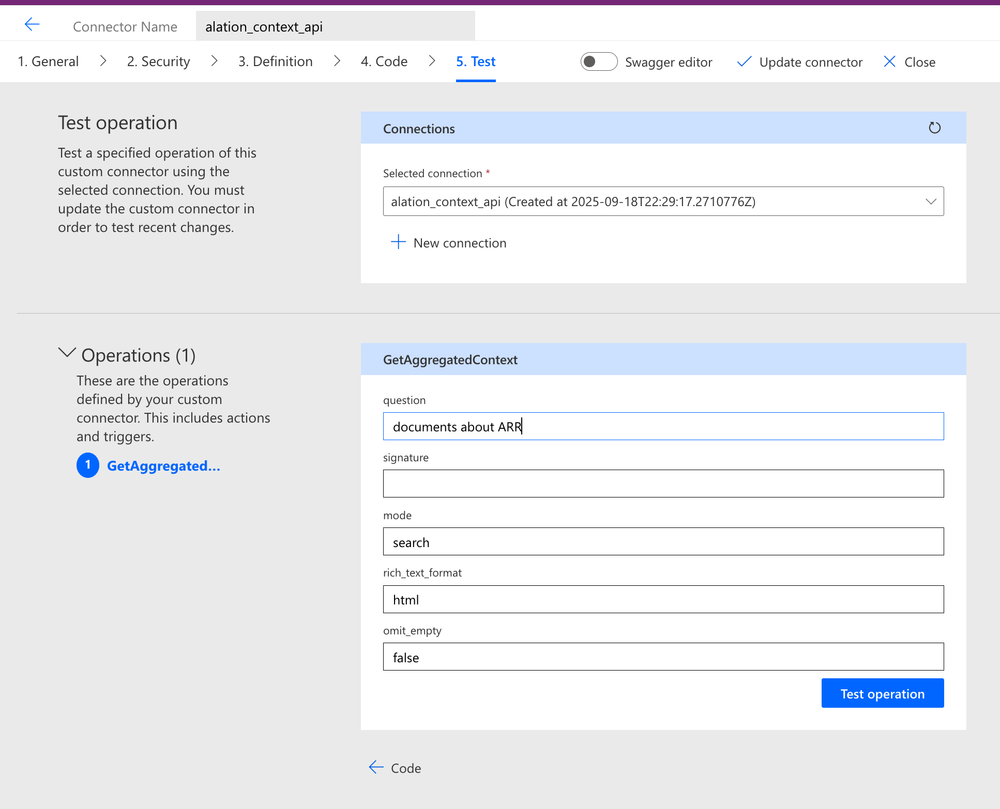

# Azure Power Apps Custom Connector with openAPI spec Setup Guide

## Overview

This guide walks you through setting up a custom connector in Microsoft Power Apps using the Alation Context API Swagger specification. The connector will enable Power Apps applications to query Alation's data catalog using natural language.

>**⚠️ Freemium API**: The Alation Aggregated Context API includes a free tier of 2,000 API calls per tenant that doesn't reset. When you reach 90% of the quota (1,800 calls), you'll receive warnings in the API response headers. Rate limiting begins at 120% (2,400 calls) with HTTP 429 responses. Contact your Alation Account Manager for paid subscription options beyond the free tier. To learn more, refer to: https://developer.alation.com/dev/docs/guide-to-aggregated-context-api-beta#free-tier-and-quotas

## Prerequisites

- Access to Microsoft Power Apps environment
- Alation API key with appropriate permissions
- [The Alation Context API Swagger specification file](./alation_context_swagger_2.yaml)

## Important Notes Before Starting

- Power Apps Custom Connectors **only support OpenAPI/Swagger 2.0**
- The Import OpenAPI file dialog can be buggy - if "Continue" is greyed out or shows errors, close the dialog and try again
- The dialog may not update properly when you re-upload a corrected file - you may need to refresh the page

## Step-by-Step Setup Process

### Step 1: Access Custom Connectors

1. Navigate to your Power Apps environment
2. Go to **Custom connectors** section
3. Click **+ New custom connector**
4. Select **Import an OpenAPI file**


### Step 2: Import the OpenAPI File

1. In the "Import an OpenAPI file" dialog:
   - **Connector name**: Enter `alation_context_api`
   - **Import an OpenAPI file**: Select your `alation_context_swagger_2.yaml` file
2. Click **Import**


**Troubleshooting Import Issues:**
- If the "Continue" button is greyed out, close the dialog and try again
- The dialog may cache the previous file - try refreshing the page if re-uploading doesn't work

### Step 3: General Configuration

Once imported, you'll be taken through a 5-step configuration process:

#### 1. General Information
Most fields will be auto-populated from your Swagger specification. You only need to customize:

- **Host**: **REQUIRED** - Enter your Alation instance hostname (e.g., `customer.alationcloud.com`)
- **Icon**: Upload a connector icon (optional) - supports PNG and JPG (< 1MB)
- **Icon background color**: Enter a hex color code (e.g., `#007ee5`)

The following are automatically populated from your Swagger file:
- **Description**: Auto-populated from the Swagger spec:
  ```
  This API takes user questions in natural language and retrieves the relevant catalog 
  objects. It supports two modes: - Search mode for retrieving objects based on relevance 
  - Bulk mode for directly retrieving specified objects to support bulk operations
  ```
- **Scheme**: Auto-populated as **HTTPS** 
- **Base URL**: Auto-populated as `/integration/v2`


### Step 4: Security Configuration

#### 2. Security Settings
1. **Authentication type**: Select **API Key**
2. **Parameter label**: Enter `API Key`
3. **Parameter name**: Enter `TOKEN`
4. **Parameter location**: Select **Header**


This configuration tells Power Apps that users will need to provide an API key in the header with the parameter name "TOKEN" when creating connections.

**Want OAuth 2.0 instead?** If you prefer OAuth 2.0 authentication, refer to [Step 3: Configure OAuth 2.0 Authentication](./azure_custom_connector_mcp_server.md#step-3-configure-oauth-20-authentication-tab-2).

### Step 5: API Definition

#### 3. Definition
The API definition should be automatically populated from your Swagger file. You should see:

- **Actions (1)**: GetAggregatedContext operation
- **References (23)**: Various schema definitions
- The main operation details including:
  - **Summary**: "Get relevant context from the Alation catalog"
  - **Description**: "Retrieves relevant objects from the Alation catalog..."
  - **Operation ID**: `GetAggregatedContext`
  - **Visibility**: Set to **none** (default)


### Step 6: Code Transformation (Optional)

#### 4. Code
This step is optional. You can add custom code transformations if needed. For basic usage, leave this section as-is with "Code Disabled" toggle off.


### Step 7: Testing

#### 5. Test
Before you can test, you must create the connector first:

1. Click **Create connector** to save your configuration
2. After creation, return to the Test tab
3. Click **+ New connection** to create a test connection

4. In the connection dialog:
   - Enter your Alation API key in the "API Key" field
   - Click **Create**


**Testing the API:**
1. Select your newly created connection

2. In the **GetAggregatedContext** operation section, enter test parameters:
   - **question**: `documents about ARR`
   - **signature**: (leave empty for basic testing)
   - **mode**: `search`
   - **rich_text_format**: `html`
   - **omit_empty**: `false`

**Need help with these parameters?**
- To learn more about how to use the API, go to: https://developer.alation.com/dev/docs/guide-to-aggregated-context-api-beta
- To customize and fine tune the output, refer to: https://developer.alation.com/dev/docs/customize-the-aggregated-context-api-calls-with-a-signature

3. Click **Test operation**



**Successful Test Response:**
You should receive a 200 status code with a JSON response containing relevant documentation:

```json
{
  "relevant_documentations": [
    {
      "title": "ARR",
      "content": "<div><h3>Definition of ARR</h3><p>Annual Recurring Revenue, or ARR, is...",
      "url": "https://genai-gartner.mtse.alationcloud.com/document/3139/",
      "custom_fields": {
        "Status": "Approved",
        "Experts": [
          {
            "display_name": "Andrew Mumford (Sr Sales Engineer)",
            "url": "https://genai-gartner.mtse.alationcloud.com/user/35/"
          }
        ]
      }
    }
  ]
}
```

