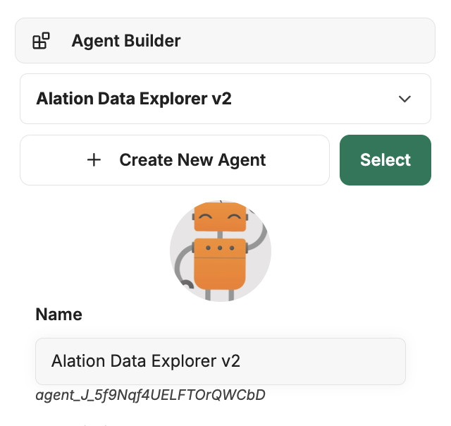
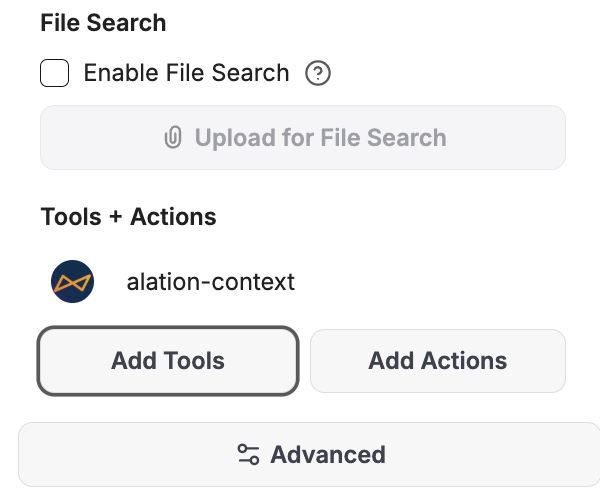
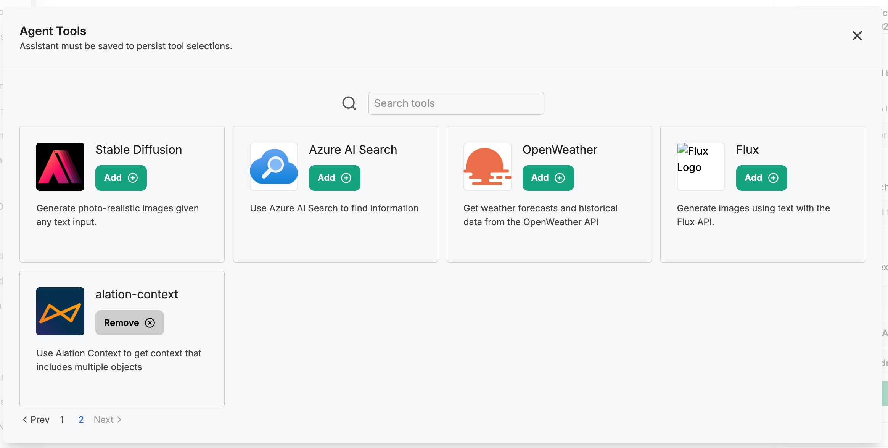

# Alation Context API Integration – LibreChat MCP Server

This guide explains how to set up and use the **Alation Context API MCP server** with LibreChat. This enables LibreChat to retrieve Alation metadata (e.g., trusted tables, documentation, schema info) contextually during conversations with AI models.

---

## Prerequisites

- Installed and configured **LibreChat** client v0.7.8 or newer ([instructions](https://www.librechat.ai/docs/quick_start/local_setup))
- Python 3.10 or higher
- Access to an Alation Data Catalog instance
- A valid refresh token or client_id and secret. For more details, refer to the [Authentication Guide](https://github.com/Alation/alation-ai-agent-sdk/blob/main/guides/authentication.md).

---

## Configuration

### Step 1: Configure Environment Variables

First, you'll need to set up environment variables for any AI providers you want to use. In your LibreChat root directory, update the `.env` file with your credentials:

#### For AWS Bedrock:
Uncomment and configure these lines in your `.env` file:
```env
BEDROCK_AWS_DEFAULT_REGION=us-east-1 # A default region must be provided
BEDROCK_AWS_ACCESS_KEY_ID=your-access-key-id
BEDROCK_AWS_SECRET_ACCESS_KEY=your-secret-access-key
```

#### For Other Providers:
Configure additional providers as needed:
```
# OpenAI
OPENAI_API_KEY=your-openai-api-key

# Anthropic
ANTHROPIC_API_KEY=your-anthropic-api-key

# Google
GOOGLE_KEY=your-google-api-key
```

### Step 2: Create librechat.yaml Configuration File

1. Copy the contents of librechat.example.yaml to a new file named librechat.yaml.
2. Edit your `librechat.yaml` configuration to define a new `mcpServer` using the `stdio` protocol. Alation MCP server currently only supports the STDIO protocol.


```yaml
mcpServers:
  alation:
    type: stdio
    command: uvx
    args:
      - "--from"
      - "alation-ai-agent-mcp"
      - "start-alation-mcp-server"
    env:
      ALATION_BASE_URL: "https://your-alation-instance.com"
      ALATION_AUTH_METHOD: "user_account"  # or "service_account"

      # For user account authentication
      ALATION_USER_ID: "your-user-id"
      ALATION_REFRESH_TOKEN: "your-refresh-token"

      # For service account authentication
      ALATION_CLIENT_ID: "your-client-id"
      ALATION_CLIENT_SECRET: "your-client-secret"
```
This command automatically pulls the [alation-agent-mcp package](https://pypi.org/project/alation-ai-agent-mcp/) from Pypi and runs it when the LLM calls it.


### Step 3: Set Up Docker Override Configuration
1. Copy the contents of docker-compose.override.yaml.example to docker-compose.override.yaml
2. Edit docker-compose.override.yaml and uncomment the following section:
```
services:
  api:
    volumes:
    - type: bind
      source: ./librechat.yaml
      target: /app/librechat.yaml
```
This ensures that your librechat.yaml configuration file is mounted into the Docker container.

### Step 4: Restart LibreChat

After updating `librechat.yaml`, restart LibreChat:

```bash
docker compose down
docker compose up -d
```
LibreChat will now be accessible at: http://localhost:3080/

Note: On first access, you'll need to:
- Register a new account (you can use any temporary email - LibreChat won't validate it)
- Login with your newly created credentialw


Confirm that LibreChat successfully loads the `alation` MCP server. If there are errors, check the logs from `docker compose logs` or MCP output directly. There is no need to start the MCP server as the LLM invoking it will auto manage the lifecycle of the server.

---

## Verifying the Integration

1. In the LibreChat UI, navigate to the agent builder using the right side navigation bar



2. Scroll down to find `Add tools`



4. If installed correctly, you should see the `Alation Context` tool listed



### Example question
```text
What certified data sets are related to revenue forecasting?
Find documentation about our customer 360 platform.
List commonly joined tables with order_summary.
```

LibreChat will invoke the MCP tool, which will forward the context API queries to your Alation instance, fetch results, and return them in the chat.

---

## Using Custom Signatures (Optional)

To fine-tune data retrieval, you can embed **signatures** learn more about them [here](../signature.md) into prompts, just like Claude Desktop.

### Example Signature for Trusted Tables

```json
{
  "table": {
    "fields_required": ["name", "description", "columns"],
    "search_filters": {
      "flags": ["Endorsement"]
    },
    "child_objects": {
      "columns": {
        "fields": ["name", "data_type", "sample_values"]
      }
    }
  }
}
```

Prompt example:

```
Use this signature to search:

{
  "table": {
    "fields_required": ["name", "description", "columns"],
    "search_filters": {
      "flags": ["Endorsement"]
    }
  }
}

What trusted tables exist for financial transactions?
```

---

## Troubleshooting

| Symptom | Solution |
|--------|----------|
| Tool doesn't show in UI | Confirm `mcpServers` is properly defined in `librechat.yaml`, and restart the backend; `docker logs LibreChat` will show mcp server init logs |
| Data not fetched correctly | Check Alation credentials (`USER_ID`, `REFRESH_TOKEN`, `ALATION_API_BASE`) |