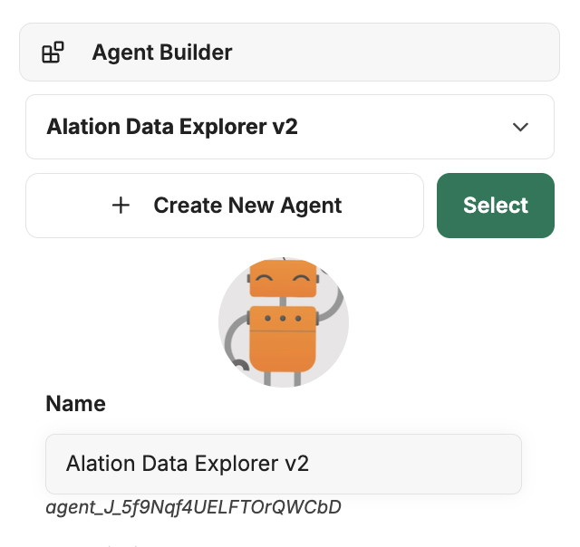
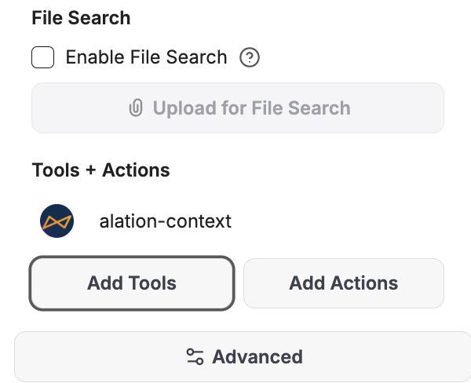
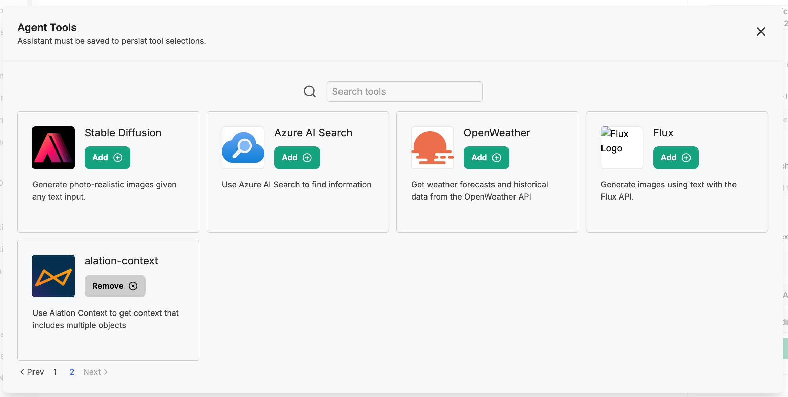

# Alation Context API Integration – LibreChat MCP Server

This guide explains how to set up and use the **Alation Context API MCP server** with LibreChat. This enables LibreChat to retrieve Alation metadata (e.g., trusted tables, documentation, schema info) contextually during conversations with AI models.

---

## Prerequisites

- Installed and configured **LibreChat** client v0.7.8 or newer ([instructions](https://www.librechat.ai/docs/quick_start/local_setup))
- Access to an Alation Cloud Service instance
- Your Alation user ID
- A valid refresh token created from your user account in Alation (Instructions on how to obtains one are available at the [developer documentation portal](https://developer.alation.com/dev/docs/authentication-into-alation-apis#create-a-refresh-token-via-the-ui))

---

## Configuration

### Step 1: Add MCP Server Entry in `librechat.yaml`

Edit your `librechat.yaml` configuration to define a new `mcpServer` using the `stdio` protocol. Alation MCP server currently only supports the STDIO protocol.


```yaml
mcpServers:
  alation:
    type: stdio
    command: uvx
    args:
      - "--from"
      - "alation-ai-agent-mcp"
      - "start-mcp-server"
    env:
      ALATION_REFRESH_TOKEN: "<your-refresh-token>"
      ALATION_USER_ID: "<user-id>"
      ALATION_BASE_URL: "https://company.mtse.alationcloud.com"
```
This command automatically pulls the [alation-agent-mcp package](https://pypi.org/project/alation-ai-agent-mcp/) from Pypi and runs it when the LLM calls it.

---

## Step 2: Restart LibreChat

After updating `librechat.yaml`, restart LibreChat:

```bash
docker compose down
docker compose up -d
```

Confirm that LibreChat successfully loads the `alation` MCP server. If there are errors, check the logs from `docker compose logs` or MCP output directly. There is no need to start the MCP server as the LLM invoking it will auto manage the lifecycle of the server.

---

## Verifying the Integration

1. In the LibreChat UI, navigate to the agent builder using the right side navigation bar



2. Scroll down to find `Add tools`



4. If installed correcntly, you should see the `Alation Context` tool listed



### Example question
```text
What certified data sets are related to revenue forecasting?
Find documentation about our customer 360 platform.
List commonly joined tables with order_summary.
```

LibreChat will invoke the MCP tool, which will forward the context API queries to your Alation instance, fetch results, and return them in the chat.

---

## Using Custom Signatures (Optional)

To fine-tune data retrieval, you can embed **signatures** learn more about them [here](../signature.md) into prompts, just like Claude Desktop.

### Example Signature for Trusted Tables

```json
{
  "table": {
    "fields_required": ["name", "description", "columns"],
    "search_filters": {
      "flags": ["Endorsement"]
    },
    "child_objects": {
      "columns": {
        "fields": ["name", "data_type", "sample_values"]
      }
    }
  }
}
```

Prompt example:

```
Use this signature to search:

{
  "table": {
    "fields_required": ["name", "description", "columns"],
    "search_filters": {
      "flags": ["Endorsement"]
    }
  }
}

What trusted tables exist for financial transactions?
```

---

## Troubleshooting

| Symptom | Solution |
|--------|----------|
| Tool doesn't show in UI | Confirm `mcpServers` is properly defined in `librechat.yaml`, and restart the backend; `docker logs LibreChat` will show mcp server init logs |
| Data not fetched correctly | Check Alation credentials (`USER_ID`, `REFRESH_TOKEN`, `ALATION_API_BASE`) |
