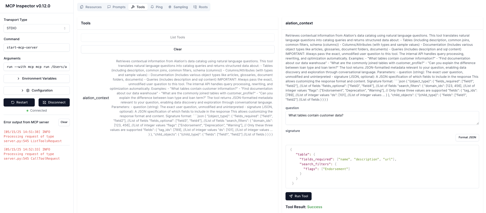

# Testing Your Alation MCP Server with Inspector

This guide walks through the process of testing your Alation AI Agent SDK's Model Context Protocol (MCP) server using the MCP Inspector tool.

## Prerequisites

- Python 3.10 or higher
- Access to an Alation Data Catalog instance
- A valid refresh token created from your user account in Alation ([instructions](https://developer.alation.com/dev/docs/authentication-into-alation-apis#create-a-refresh-token-via-the-ui))
- Node.js installed (for npx)

## Step 1: Set Required Environment Variables

The Alation MCP server requires three environment variables:

```bash
# Set environment variables for your Alation instance
export ALATION_BASE_URL="https://your-alation-instance.com"
export ALATION_USER_ID="123456"  # Your numeric user ID
export ALATION_REFRESH_TOKEN="your-refresh-token"
```

Verify the variables are properly set:

```bash
echo $ALATION_BASE_URL
echo $ALATION_USER_ID
echo $ALATION_REFRESH_TOKEN
```

## Step 2: Run the MCP Server with Inspector

You have several options to run your server with the MCP Inspector:

### Option 1: Using uvx
```bash
uvx --from alation-ai-agent-mcp start-mcp-server
# Then run the MCP Inspector:
npx @modelcontextprotocol/inspector uvx --from alation-ai-agent-mcp start-mcp-server
```

### Option 2: Using pip with Inspector
```bash
# Install the package via pip
pip install alation-ai-agent-mcp
# Then run:
npx @modelcontextprotocol/inspector start-mcp-server
```

### Option 3: Direct python execution
```bash
# Navigate to your python directory first
cd /path/to/workspace/ai-agent-sdk/python

# Run the server with NPX
npx @modelcontextprotocol/inspector python /home/username/projects/ai-agent-sdk/python/dist-mcp/alation_ai_agent_mcp/server.py
```

Any of these approaches will launch the MCP Inspector UI in your browser.

## Step 3: Test with the Inspector UI

1. Click the "Connect" button in the Inspector UI
2. Once connected, navigate to the "Tools" tab
3. Click "List Tools" to see available tools
4. Select the "alation_context" tool from the list
5. In the right panel, enter your natural language question in the "question" section. 
6. Click "Call Tool" to execute
7. Review the response in the results section below




## Using Signatures with MCP Inspector

The Alation AI Agent SDK supports customizing data retrieval through signatures. For detailed documentation on signature format and capabilities, see [Using Signatures](../signature.md).

### Testing Signatures with MCP Inspector

1. Start the MCP Inspector and connect to your Alation MCP server
2. Navigate to the "Tools" tab and select "alation_context"
3. In the "question" field, enter your natural language query
4. In the "signature" field, paste your JSON signature
5. Click "Call Tool" to execute

Example:
```
#Question:
What tables contain customer data?
```
```
#Signature:
 {
    "table": {
      "fields_required": ["name", "description", "url"],
      "search_filters": {
        "flags": ["Endorsement"]
      }
    }
  }
```

## Troubleshooting

If you encounter issues:

- **Connection errors**: Verify environment variables are set correctly
- **Tool execution failures**: Check Alation instance connectivity
- **Missing dependencies**: Run `pip install -r requirements.txt` to ensure all dependencies are installed
- **Path issues**: Use absolute paths when running commands
