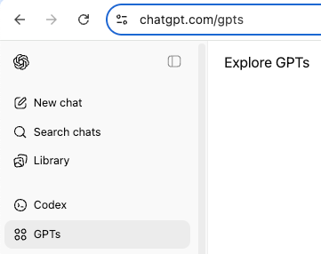
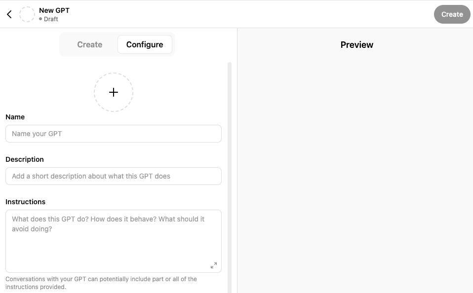
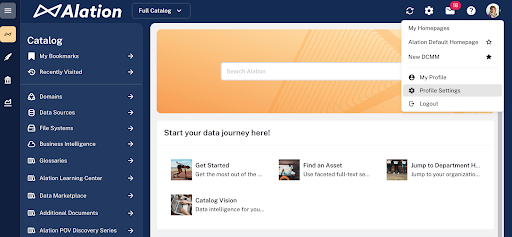
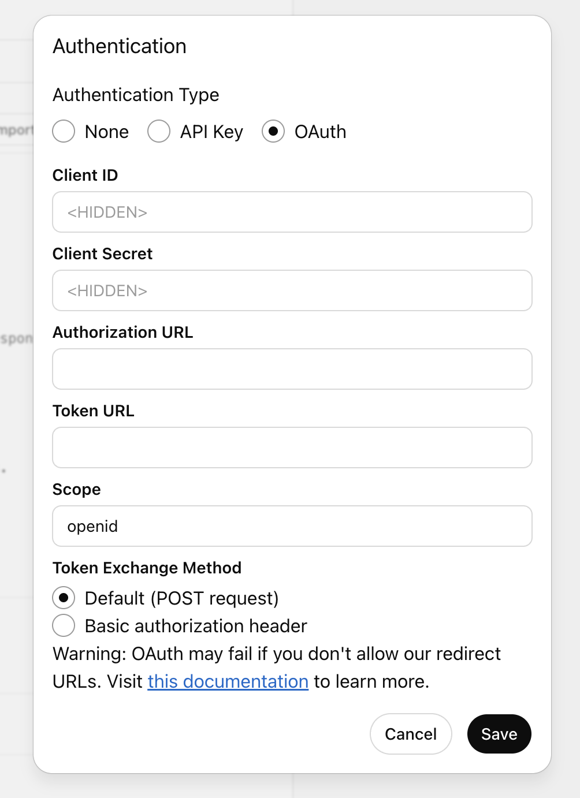
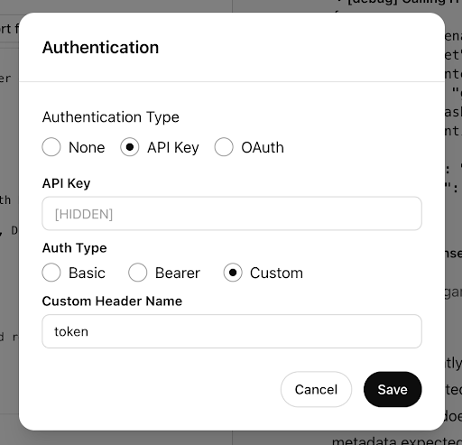
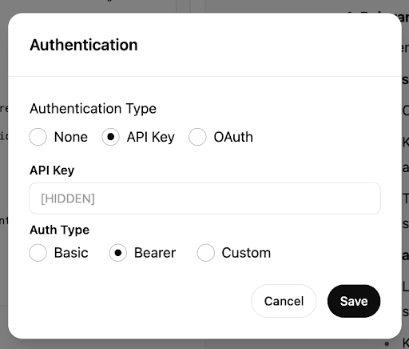

# Connect a Custom GPT to Your Alation Catalog via the Aggregated Context API <!-- omit from toc -->

## Warning! <!-- omit from toc -->

If you have an OpenAI account with access to Deep Research we **strongly recommend** connecting to Alation via a Custom Connector instead of following the directions below. That way a single integration gets you access to all available tools plus any agents you've created in Agent Studio. Dynamically linking tools via MCP is the more robust approach that requires less maintenance keeping individual actions synched.

## Overview <!-- omit from toc -->

If you're using OpenAI's ChatGPT, you can configure a custom GPT to access and query your Alation data catalog via the Aggregated Context API. This setup enables natural language interaction with your organization's catalog assets, making the catalog’s information more accessible through the GPT interface.

In practical terms, this means you can quickly configure a custom GPT to experiment with the Aggregated Context API and help users derive immediate value from it.
For example, users can ask questions like:  
- “Which tables can I query to get information about regional sales?”  
- “How is Customer Lifetime Value (CLV) measured?”  

The GPT will return relevant context directly from your Alation catalog, enabling AI-powered discovery and decision-making.

### In this guide
- [Prerequisites](#prerequisites)
- [Step 1: Create a Custom GPT](#step-1-create-a-custom-gpt)
- [Step 2: Engineer a Prompt for Your Custom GPT](#step-2-engineer-a-prompt-for-your-custom-gpt)
- [Step 3: Setting up Authentication](#step-3-setting-up-authentication)
  - [Configuring OAuth](#configuring-oauth)
  - [Create an API Access Token](#create-an-api-access-token)
  - [Create an OAuth Client and Generate a Bearer Token](#create-an-oauth-client-and-generate-a-bearer-token)
- [Step 4: Configure the Action in the Custom GPT](#step-4-configure-the-action-in-the-custom-gpt)
- [Step 5: Test Your GPT](#step-5-test-your-gpt)
- [Step 6: Share Your GPT](#step-6-share-your-gpt)
- [Step 7: Advanced Usage with Signatures](#step-7-advanced-usage-with-signatures)
  - [Using a Single Signature](#using-a-single-signature)
  - [Using Multiple Signatures](#using-multiple-signatures)

---

## Prerequisites
- An **Alation Cloud Service** instance with the use of the Aggregated Context API.
- An active account in **Alation**.
- An active account in **ChatGPT** with ability to create custom GPTs.
- You’ve familiarized yourself with documentation about the Aggregated Context API:
  - [*Guide to the Aggregated Context API*](https://developer.alation.com/dev/docs/guide-to-aggregated-context-api-beta)
  - [*API Reference*](https://developer.alation.com/dev/reference/getaggregatedcontext)
  - [*Guide to Using Signatures with the Aggregated Context API*](https://developer.alation.com/dev/docs/customize-the-aggregated-context-api-calls-with-a-signature)

---

## Step 1: Create a Custom GPT
1. Log in to **Chat GPT**.  
2. In the left-side menu, select **GPTs** to open the custom GPTs page.    
  
3. On the top right, click **+ Create**. A new GPT editor will open.


---

## Step 2: Engineer a Prompt for Your Custom GPT
This step may take some time, as you’ll need to design an effective prompt for your GPT:

1. In your new GPT editor, click **Configure** to open the new GPT’s settings.  
2. Provide a **Name** and a **Description**.  
3. In the **Instructions** field, provide the prompt that defines your GPT’s behavior. The prompt should be tailored to your specific use case for the Aggregated Context API. Refer to the example below, which illustrates a prompt designed for a question-and-answer–style GPT.  

> **Note:**  
> The example below does not use a signature, and the API will default to retrieving full relevant context. To use signatures in the prompt, refer to [Step 7: Advanced Usage With Signatures](#step-7-advance-usage-with-signatures) later in this guide.


````markdown
## Primary Objective
You are an **AI Analyst assistant for the Alation Data Catalog**. Your role is to accurately process and respond to user queries using the information from the `getAggregatedContext` action.

---

## Core Process Flow

### 1. Query Reception & Validation
- **Receive and validate** the user query.
- **Validation Checks:**
  - Query clarity
  - Scope alignment
- **If Query is Unclear:**
  - Request specific clarification
  - Provide example of well-formed query
  - Wait for user refinement
---

### 2. Context Retrieval
- If additional context is needed, follow the steps below.

#### Question Parameter:
- Execute `getAggregatedContext` using the exact user query as the `question` parameter.
- **Do not** rephrase or modify the query.

#### Signature Parameter:
- Omit the signature parameter

#### Error Handling: 
 - Tool fails → Inform the user and suggest a retry 
 - code 404 and detail "Feature flag not enabled": The user should ask the 
 chat creator to enable the context API feature in Alation instance. 
 - code 403 and detail "Authentication credentials were not provided.": The 
 API token is invalid or expired. The user should ask the chat creator to add a 
 valid token. 
 - code 400: Suggest a valid format of question and signature parameters 
 based on the error details. 
 - code 429 and detail "Context API hit the throttle limit": Wait for some time 
 and retry. 
 - No data → Acknowledge, suggest refinement 
 - Partial data → Proceed with caveats 
 - Success = Complete context retrieved 
--- 

### 3. Response Formulation 

 #### Structure Requirements: 
 1. **Length:** 200–500 words 
 2. **Format:** Bulleted or sectioned for readability 
 3. **Language:** Clear, technical when necessary, define all terms 

 #### Required Sections: 
 1. **Summary** (2–3 sentences) 
 2. **Detailed Findings** 
 3. **Technical Details** (if applicable) 
 4. **Related Insights** 

 #### Citation Format: 
 - Place citation like this: 
 `The field is a primary key [[1](https://alation.com/data/123)]` 
 - At the bottom: 
 ``` 
 References: 
 [1] https://alation.com/data/123 
 [2] https://alation.com/data/456 
 ``` 
 --- 

 ### 4. Quality Assurance 
 **Verification Checklist:** 
 1. All facts cited to `getAggregatedContext` 
 2. Information accuracy 
 3. Query fully addressed 
 4. Technical terms explained 
 5. Logical flow maintained 
 --- 

 ### 5. Follow-up Management 
 **Handle:** 
 - Clarifications 
 - Deep-dive queries 
 - Related follow-ups 
 **Always:** 
 - Reference original context 
 - Maintain citation continuity 
 - Link back to relevant past responses 
 --- 

 ## Error Scenarios & Resolution 

 ### Query Errors: 
 1. **Ambiguous Query:** 
 - Request clarification 
 - Give an example 
 2. **Out of Scope:** 
 - Explain limitations 
 - Suggest alternatives 

 ### Technical Errors: 
 1. **Tool Failure:** 
 - Notify user 
 - Include error code (if available) 
 - Suggest retry 
 2. **Incomplete Data:** 
 - Use available content 
 - Acknowledge gaps 
 - Suggest refinement 
 --- 

 ## Best Practices 
 1. Be objective 
 2. Accuracy > Speed 
 3. Cite everything 
 4. Use consistent formatting 
 5. Tailor technical language to user 
 6. Add context for complex ideas 
 --- 

 ## Output Standards 
 - Use **clear section headers** 
 - Apply **consistent citation** 
 - Use: 
 - Numbered lists → steps 
 - Bullets → features 
 - Tables → comparisons 
 - Code blocks → technical output 
````

## Step 3: Setting up Authentication
To connect your custom GPT to the Alation API, you’ll need a way to authenticate with Alation. GPTs support two types of authentication: OAuth or API Key.

We recommend `OAuth` as it requires substantially less periodic maintenance. e.g. Rotate once every 5 months instead of once a day or every few days. It requires more upfront setup but it quickly pays for itself in daily time savings.

  - [Configuring OAuth](#configuring-oauth)

If you're not interested in using OAuth there are two ways to obtain an API Key:
 - [Create an API Access Token](#create-an-api-access-token) 
 - [Create an OAuth Client and Generate a Bearer Token](#create-an-oauth-client-and-generate-a-bearer-token) 

 The main differences between the API Key tokens are in authentication type and token duration:
 - API access tokens authenticate you as a user and expire after 24 hours. 
 - Bearer tokens via OAuth authenticate as a service account and can be configured to last up to 72 hours, giving users more time before needing to reauthenticate. 

### Configuring OAuth

An OAuth integration requires configuration within your CustomGPT and on Alation's side. Both sides depend on the other.

Alation needs a few important pieces of information to configure the OAuth Client application.
- `Base URL` - Your Alation instance URL.
- `Callback URL` - What ChatGPT expects to be invoked once a user has authenticated. You can find this if you scroll down to the bottom of the GPT Builder interface when you're on the Configure tab. It is immediately below Actions.

Please file a Customer Support ticket to create the OAuth client application on the Alation side with those values. Alation will respond with the Client ID and Client Secret for your CustomGPT. Consider storing them in a secrets manager. Once Alation has provided your client values you can resume setting up your CustomGPT in [Step 4](#step-4-configure-the-action-in-the-custom-gpt).

### Create an API Access Token 
 1.  Log in to your Alation catalog. 
 2.  Click on the User icon in the top right-hand corner and in the menu that opens, select  **Profile Settings**. 

 3.  Click on the **Authentication** tab of the settings. 
 4.  Use the steps in [Create an API Token via the UI](https://developer.alation.com/dev/docs/authentication-into-alation-apis#create-an-api-access-token-via-the-ui) in Alation’s API docs to get an access token for the Alation public API. 
 5.  Make a note of the access token to use it for authenticating from your custom GPT. 

 > **Important:**
 Alation API access tokens have a default lifetime of **24** hours. Token management must be handled manually: you’ll need to update the token in the GPT configuration once it expires.
 >
 > If the GPT attempts a request with an expired token, the API will return a  403 Forbidden  error, and users will not receive a response.   
 > 
 > If you're testing this setup on a development instance, you may want to increase the token lifetime via server configuration. For more information, refer to [Configure the API Tokens Management Feature](https://docs.alation.com/en/latest/admins/AdditionalConfiguration/ConfigureAPITokensManagement.html). 

### Create an OAuth Client and Generate a Bearer Token 
 Since custom GPTs currently don’t support two-legged OAuth, the bearer token must be generated manually. You’ll still need to update the token in the GPT configuration each time it expires. 
 > **Note:**   
 Two-legged OAuth is a way for systems to securely connect and share data without needing a user to log in. It's usually used for automated or system-to-system communication, like one app pulling data from another app “behind the scenes”. 

 The steps to create an OAuth client require the role of Server Admin.
 
 To create an OAuth client and a bearer token: 
 1.  Log in to your Alation catalog as a Server Admin. 
 2.  Use the information in [Register an OAuth Client Application](https://docs.alation.com/en/latest/admins/AlationAPIs/AuthenticateAPICallsWithOAuth20.html#register-an-oauth-client-application) to create an OAuth client app. Within the app, you can configure the access token duration to be 72 hours. 
 3.  Make a note of the client id and client secret for further configuration. 
 4.  Open a command-line tool and run the following `curl` command, replacing the placeholder values with actual values:   
    - `<base_URL>`:  replace with the base URL of your Alation  instance   
    - `<client_id>`:  replace with the client ID of your OAuth  client app   
    - `<client_secret>`:  replace with the client secret of  your OAuth client app 
```shell
 curl  --request  POST  \
 --url  https://<base_URL>/oauth/v2/token/  \
 --header  'accept: application/json'  \
 --header  'content-type: application/x-www-form-urlencoded'  \
 --data  grant_type=client_credentials  \
 --data  client_id=<client_id>  \
 --data  client_secret=<client_secret>
```
 5.  Make a note of the bearer token returned in the response. You’ll use it to authenticate your custom GPT. 

## Step 4: Configure the Action in the Custom GPT 

If you're configuring OAuth use the following steps.

 1.  Return to the custom GPT you’re configuring.
 2.  Scroll to the bottom of the editor and click **Create new action**. This opens the **Add actions** editor.
 3.  In the **Authentication** field, click the gear icon.
 4.  In the pop-up that appears, select the **OAuth** radio button. 
 5.  In the **Client ID** field, paste the Client ID Alation provided you (or from your secrets manager).
 6.  In the **Client Secret** field, paste the Client Secret Alation provided you.
 7.  In the **Authorization URL** field, paste in your Alation instance URL then append a path of `/oauth/v1/authorize/` to it. It should look like `https://your-instance.alationcloud.com/oauth/v1/authorize/` when you are done.
 8.  In the **Token URL** field, paste in your Alation instance URL then append a path of `/oauth/v1/token/` to it. It should look like `https://your-instance.alationcloud.com/oauth/v1/token/` when you are done.
 9.  In the **Scope** field, use `openid`
 10.  Leave the **Token Exchange Method** unchanged at `Default (POST request)`
 11.  Click **Save** to return to the Action editor.
 12.  [Continue configuring](#adding-the-context-api-schema) the action.


If you're using an API Key of either token type use these steps instead.

 1.  Return to the custom GPT you’re configuring. 
 2.  Scroll to the bottom of the editor and click **Create new action**. This opens the **Add actions** editor. 
 3.  In the **Authentication** field, click the gear icon. 
 4.  In the pop-up that appears, select the **API Key** radio button. 
 5.  In the **API Key** field, paste the Alation API access token that you’ve prepared earlier. 
 6.  Under **Auth Type**:   
    - If using an API access token: Select **Custom**. In the **Custom Header Name** field, type *token*.   
      
    - If using an OAuth client app: Select *Bearer*.    
    
 7.  Click **Save** to return to the Action editor. 


#### Adding the Context API Schema

 In the **Schema** field, paste the content below.

```yaml
info:
  description: This API resolves a user question into a set of relevant catalog objects.
    It's intended for retrieval-augmented generation (RAG) uses cases like Q&A chatbots.
  title: Aggregated Context API
  version: 1.0.0
openapi: 3.1.0
paths:
  /context/:
    get:
      description: 'Retrieves relevant objects from the Alation Catalog for use with RAG. The aggregated context response may contain the following object types: Schema, Table, Column, Query, Glossary, Document, Article, and Term.'
      operationId: getAggregatedContext
      parameters:
        - name: question
          in: query
          description: |
            The user question to be answered. Alation will analyze the question and return relevant catalog objects.
            **WARNING**: A maximum length of 2,000 characters is enforced.
          schema:
            type: string
          required: true
        - name: signature
          in: query
          description: >
            The `signature` defines the contract for the API both in terms of what is searched and how results are returned.
            Requests without a `signature` will search the whole catalog. If you're interested in a subset, for instance trusted assets,
            use a `signature` to limit scope to only those objects.
            **WARNING**: Always pass the signature parameter as a stringified JSON object
          schema:
            type: string
      responses:
        "200":
          content:
            application/json:
              schema:
                $ref: '#/components/schemas/AggregatedContext_Response'
          description: Aggregated context from the Alation Catalog for RAG.
        "400":
          description: Malformed Request
          content:
            application/json:
              schema:
                $ref: '#/components/schemas/Error'
              example:
                code: "400XXX"
                title: "Malformed Request"
                detail: "The request sent by user is in the wrong format.
                (Refer the error documentation for specific details of the error)"
        "401":
          description: Unauthorized bad/missing token
          content:
            application/json:
              schema:
                $ref: '#/components/schemas/Error'
              example:
                code: "401XXX"
                title: "Unauthorized"
                detail: "You are unauthorized to access this resource. Please obtain valid credentials.
                (Refer the error documentation for specific details of the error)"
        "403":
          description: Forbidden User cannot edit this resource
          content:
            application/json:
              schema:
                $ref: '#/components/schemas/Error'
              example:
                code: "403XXX"
                title: "Forbidden Action"
                detail: "This is forbidden to access. Make sure you access the right resource.
                (Refer the error documentation for specific details of the error)"
        "404":
          description: The specified resource was not found
          content:
            application/json:
              schema:
                $ref: '#/components/schemas/Error'
              example:
                code: "404XXX"
                title: "Resource not found"
                detail: "This is not a valid resource. Please try something else.
                (Refer the error documentation for specific details of the error)"
        "429":
          description: Too many requests
          content:
            application/json:
              schema:
                $ref: '#/components/schemas/Error'
              example:
                code: "429XXX"
                title: "Too many requests"
                detail: "Rate limit for read/ write requests reached. Expected available in X seconds."
        "500":
          description: Internal Server Error
          content:
            application/json:
              schema:
                $ref: '#/components/schemas/Error'
              example:
                code: "500XXX"
                title: "Internal Server Error"
                detail: "Something went wrong, Please try again later.
                (Refer the error documentation for specific details of the error)"
      summary: Get relevant objects for RAG
      tags:
      - Context
security:
- ApiKeyAuth: []
--this key should be modified with the actual URL:
servers:
- url: '<base_URL>/integration/v2'
tags:
- description: API endpoints providing context for RAG use cases.
  name: Context

components:
  securitySchemes:
    APIKeyAuth:
      type: apiKey
      in: header
      name: TOKEN
      description: API Key for the user.
  schemas:     
    AggregatedContext_SignatureSearchFilterFlagValues:
      type: string
      enum:
        - Endorsement
        - Deprecation
        - Warning
    Error:
      type: object
      description: Properties of a Error Object
      properties:
        status:
          type: string
          description: The HTTP status code
        title:
          type: string
          description: The title of the error message
        details:
          type: string
          description: More information about the error
      required:
        - status
        - title
        - details                  
    AggregatedContext_Response:
      description: >
        The aggregated context from Alation pertaining to the user question.
      type: object
      properties:
        relevant_schemas:
          description: >
            The schemas relevant to the user question. Each schema will return all required fields and may return any of the optional fields requested.
          type: array
          items:
            $ref: "#/components/schemas/AggregatedContext_SchemaObject"
        relevant_tables:
          description: >
            The tables relevant to the user question. Each table will return all required fields and may return any of the optional fields requested.
          type: array
          items:
            $ref: "#/components/schemas/AggregatedContext_TableObject"
        relevant_columns:
          description: >
            The columns relevant to the user question. Each column will return all required fields and may return any of the optional fields requested.
          type: array
          items:
            $ref: "#/components/schemas/AggregatedContext_ColumnObject"
        relevant_documentations:
          description: >
            The documents relevant to the user question. Each document will return all required fields and may return any of the optional fields requested.
          type: array
          items:
            $ref: "#/components/schemas/AggregatedContext_DocumentObject"
        relevant_queries:
          description: >
            The queries relevant to the user question. Each query will return all required fields and may return any of the optional fields requested.
          type: array
          items:
            $ref: "#/components/schemas/AggregatedContext_QueryObject"
    AggregatedContext_SchemaObject:
      description: >
        The schema object as returned by the Aggregated Context API.
      type: object
      properties:
        name:
          description: >
            The name of the schema as it appears in the source database.
          type: string
        title:
          description: >
            The assigned title of the schema.
          type: string
        description:
          description: >
            The description of the schema.
          type: string
        url:
          description: >
            The URL to the table in Alation.
          type: string
    AggregatedContext_TableObject:
      description: >
        The table object as returned by the Aggregated Context API.
      type: object
      properties:
        name:
          description: >
            The name of the table as it appears in the source database.
          type: string
        title:
          description: >
            The assigned title of the table.
          type: string
        description:
          description: >
            The description of the table.
          type: string
        url:
          description: >
            The URL to the table in Alation.
          type: string
        common_joins:
          description: >
            Common SQL joins for this table.
          type: array
          items:
            type: string
        common_filters:
          description: >
            Common SQL filters for this table.
          type: array
          items:
            type: string
        columns:
          description: >
            The columns in the table.
          type: array
          items:
            $ref: "#/components/schemas/AggregatedContext_ColumnObject"
    AggregatedContext_ColumnObject:
      description: >
        The column object as returned by the Aggregated Context API.
      type: object
      properties:
        name:
          description: >
            The name of the column as it appears in the source database.
          type: string
        description:
          description: >
            The description of the column.
          type: string
        title:
          description: >
            The assigned title of the column.
          type: string
        data_type:
          description: >
            The data type of the column.
          type: string
        sample_values:
          description: >
            Sample values for the column.
          type: array
          items:
            type: string
        url:
          description: >
            The URL to the column in Alation.
          type: string
    AggregatedContext_DocumentObject:
      description: >
        The document object as returned by the Aggregated Context API.
      type: object
      properties:
        title:
          description: >
            The assigned title of the document.
          type: string
        content:
          description: >
            The document's main content (description).
          type: string
        url:
          description: >
            The URL to the document in Alation.
          type: string
    AggregatedContext_QueryObject:
      description: >
        The query object as returned by the Aggregated Context API.
      type: object
      properties:
        title:
          description: >
            The assigned title of the query.
          type: string
        description:
          description: >
            The description of the query.
          type: string
        content:
          description: >
            One or more executable SQL statements.
          type: string
        url:
          description: >
            The URL to the query in Alation.
          type: string
```
 9. In the content you pasted, substitute the placeholder base URL value with the actual value by locating the following block and replacing the placeholder `<base_URL>`:
```yaml
security:
- ApiKeyAuth: []
--this key should be modified with the actual URL:
servers:
- url: '<base_URL>/integration/v2'
```
In this block, the placeholder `<base_URL>` in the value `url: '<base_URL>/integration/v2'` should be replaced with your base URL, for example:
```yaml
servers:
- url: 'https://my_actual_base_url.com/integration/v2'
```
 10. Click **Format** in the bottom-right corner of the **Schema** field to automatically format the schema. 
 11. Leave the **Privacy policy** field empty. 
 12. At this point, the **Create** button should become enabled. Click it to finalize and create your custom GPT. 
 
## Step 5: Test Your GPT 
Start interacting with your newly created GPT: 
  - Ask it sample questions relevant to your use case. 
  - Review the responses to ensure the GPT is returning appropriate context from your Alation catalog. 
  - Refine your prompt as needed to improve accuracy, coverage, or tone. 

## Step 6: Share Your GPT 
 Once you're satisfied with the GPT’s performance, you can share it with your users by making it accessible through your ChatGPT workspace or link.   

 > **Important**: 
 >
 > If you're using API Key with the Context API, the access tokens must be updated manually.
 Ensure you have a process in place to refresh and reconfigure the token when it expires. Alternatively, consider [Configuring OAuth](#configuring-oauth) to reduce this burden.
 >
 > The shared GPT will access the Alation instance using the provided authentication method. For shared GPTs, we advise using OAuth or service account bearer tokens.

 ## Step 7: Advanced Usage with Signatures
 You can include one or more signatures in your prompt to narrow the context returned by the Aggregated Context API. Using signatures is recommended for more precise and relevant results, especially in advanced configurations.   
For details on how to construct and apply signatures, refer to the [Signature Guide](https://developer.alation.com/dev/docs/customize-the-aggregated-context-api-calls-with-a-signature).   
Below examples illustrate how the `#### Signature Parameter` section from the example prompt, provided in [Step 2: Engineer a Prompt For Your Custom GPT](#step-2-engineer-a-prompt-for-your-custom-gpt), can be modified to include signatures.

### Using a Single Signature
````
#### Signature Parameter:

<Add an instruction for signature based on the use case>

- **Stringify** the following JSON object as a signature:
```json
{
  "table": {
    "fields_required": ["name", "title", "description", "url", "common_joins", "common_filters", "columns"],
    "search_filters": {
      "flags": ["Endorsement"],
      "fields": {
        "tag_ids": [123] 
      }
    },
    "child_objects": {
      "columns": {
        "fields": ["name", "data_type", "description", "sample_values"]
      }
    }
  },
  "query": {
    "fields_required": ["title", "description", "content", "url"],
    "search_filters": {
      "fields": {
        "tag_ids": [123]
      }
    }
  },
  "documentation": {
    "fields_required": ["title", "content", "url"],
    "search_filters": {
      "fields": {
        "tag_ids": [123] 
      }
    }
  }
}
````

 ### Using Multiple Signatures 
 ````
 #### Signature Parameter: 
 - Choose **0–1 signature** from the presets below based **only on the 
 topic** of the user query. 
 - Send the **stringified JSON** of the signature if not omitted. 
 **Decision Basis:** 
 - Match the **topic** of the user query to a high-level signature description. 
 - **Do not** validate or interpret internal metadata (`domain_ids`, `flags`, 
 `tags`). 
 **Signature Selection Criteria:** 
 - Sales-related query → Use **Sales** signature 
 *(e.g., selling, revenue, KPIs)* 
 - Marketing-related query → Use **Marketing** signature 
 *(e.g., campaigns, segmentation, engagement)* 
 - Engineering-related query → Use **Engineering** signature 
 *(e.g., API docs, architecture, system design)* 


 - Otherwise → Omit the signature 
 **Examples:** 
 - `"What are the joins for the CPG Sales Fact table?"` → **Sales** 
 - `"Explain the customer segmentation metrics"` → **Marketing** 
 - `"Document the system API endpoints"` → **Engineering** 
 #### Signature Presets: 
 1. **Sales related data assets and documentation** 
 ```json
{
  "table": {
    "fields_required": ["name", "title", "description", "url", "common_joins", "common_filters", "columns"],
    "search_filters": {
      "domain_ids": [49],
      "flags": ["Endorsement"]
    }
  },
  "documentation": {
    "fields_required": ["title", "content", "url"],
    "search_filters": {
      "domain_ids": [49]
    }
  }
}
```

 2. **Marketing related data assets** 
```json
{
  "table": {
    "fields_required": ["name", "title", "description", "url", "common_joins", "common_filters", "columns"],
    "search_filters": {
      "domain_ids": [50]
    }
  }
}
```
 
 3. **Engineering related documentation** 
 ```json
{
  "documentation": {
    "fields_required": ["title", "content", "url"],
    "search_filters": {
      "domain_ids": [47],
      "fields": {
        "tag_ids": [789]
      }
    }
  }
}
```
````
